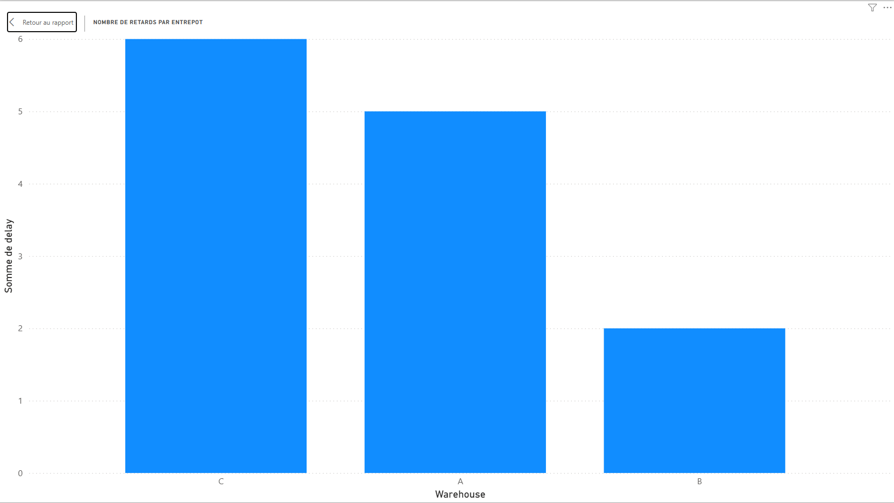
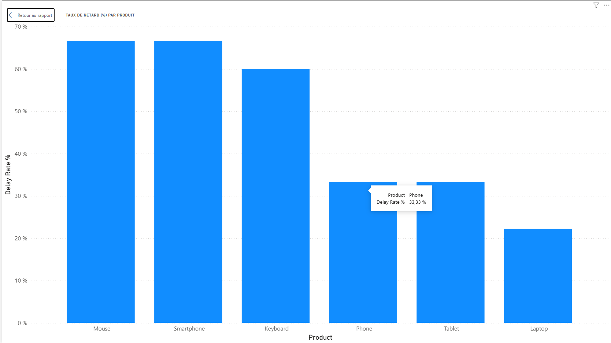
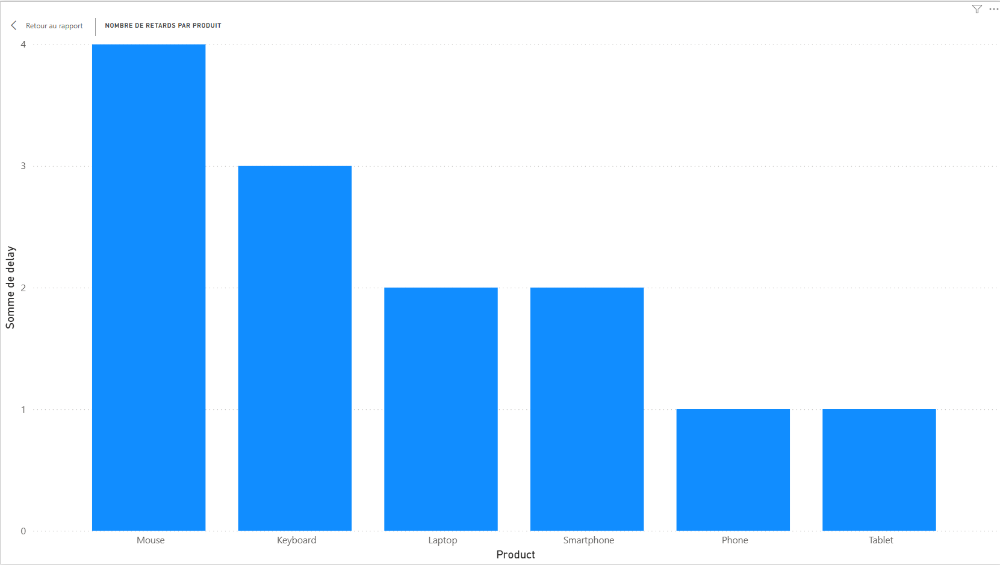

# Analyse des retards logistiques

## Description

Ce projet consiste à analyser les retards logistiques à l'aide de SQL et Power BI.

L'objectif est d'identifier les principales sources de retard, d'évaluer la performance des entrepôts et de produire des tableaux de bord permettant d'appuyer la prise de décision.

---

## Technologies utilisées

* SQL
* MySQL
* Power BI
* Excel / CSV

---

## Étapes du projet

1. Collecte et préparation des données
2. Analyse des données avec SQL
3. Création d'indicateurs de performance (KPI)
4. Conception d'un tableau de bord Power BI
5. Interprétation des résultats

---

## Indicateurs analysés

* Nombre de retards par entrepôt
* Taux de retard par produit
* Nombre de retards par produit
* Performance globale des opérations logistiques

---

## Fichiers du projet

* `Projet Data.csv` : jeu de données utilisé
* `Logistics_Delay_Analysis.pbix` : tableau de bord Power BI
* `Analyse_Logistique.docx` : rapport d'analyse incluant les captures d'écran des tableaux de bord Power BI

---

## Aperçu du tableau de bord

### Nombre de retards par entrepôt

### Taux de retard par produit

### Nombre de retards par produit

---

## Compétences démontrées

* Analyse de données
* SQL
* Nettoyage et préparation des données
* Visualisation de données
* Power BI
* Création de KPI
* Intelligence d'affaires (Business Intelligence)

---

## Auteur

Mohamed Mounig

